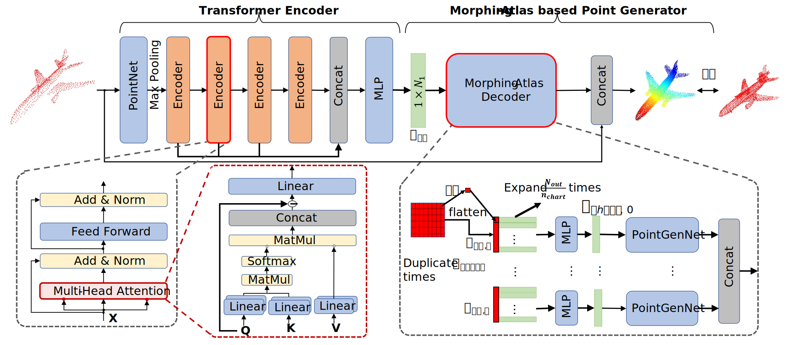

## PCTMA-Net: Point Cloud Transformer with Morphing Atlas-based Point Generation Network for Dense Point Cloud Completion
[[paper]](https://www.researchgate.net/publication/353955048_PCTMA-Net_Point_Cloud_Transformer_with_Morphing_Atlas-based_Point_Generation_Network_for_Dense_Point_Cloud_Completion)[[project page]](https://linjianjie.github.io/pctMA-Net/)	

### Introduction

PCTMA-Net is a point transformer based shape completion method which directly maps a partial point cloud to a dense, complete point cloud without any voxelization. Its based on our IROS2021 [[paper]](https://www.researchgate.net/publication/353955048_PCTMA-Net_Point_Cloud_Transformer_with_Morphing_Atlas-based_Point_Generation_Network_for_Dense_Point_Cloud_Completion)
more details please refers to our paper
 

### Usage
#### 1) Prerequisite
1. Install dependencies via `pip3 install -r requirments.txt`.
2. Follow [this guide](http://open3d.org/docs/getting_started.html) to install Open3D for point cloud I/O.
3. Build the point cloud distance metric in the folder pointComNet\pytorch_utils\components\externs_tools by running build.sh
4. Download dataset from [[Completion3D]](https://completion3d.stanford.edu/) and [[Kitti]](https://drive.google.com/drive/folders/1fSu0_huWhticAlzLh3Ejpg8zxzqO1z-F?usp=sharing)

	
This code is built using pytorch 1.7 with CUDA 10.0 and tested on Ubuntu 18.04 with Python 3.7
### Configuration
The configuration file for defining the PCTMA-Net parameter is located in  ```pointComNet/config/pct_ma.yaml```
### Train 
run the train demo in the pCTMA-Net by setting the value ``` --train True --evaluate False````
```
cd script
bash run_pctma_net.sh 
```

### Evaluate 
run the evaluate demo in the pCTMA-Net by setting the value ``` --train False --evaluate True````
```
cd script
bash run_pctma_net.sh 
```
For evaluating the kitti dataset, you can easily set the value ```--evaluateKitti  True``` 

### Citation
If you find our work useful for your research, please cite:
```
@InProceedings{linpctma2021,
  author    = {Lin, Jianjie and Rickert, Markus and Perzylo, Alexander and Knoll, Alois},
  booktitle = {Proceedings of the IEEE/RSJ International Conference on Intelligent Robots and Systems},
  title     = {{PCTMA}-{N}et: Point Cloud Transformer with Morphing Atlas-based Point Generation Network for Dense Point Cloud Completion},
  year      = {2021},
}
```
### License
This project Code is released under the GPLv2 License (refer to the LICENSE file for details).
